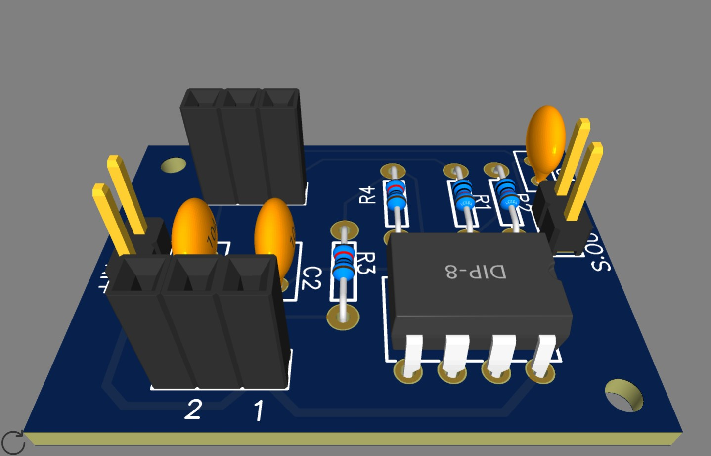
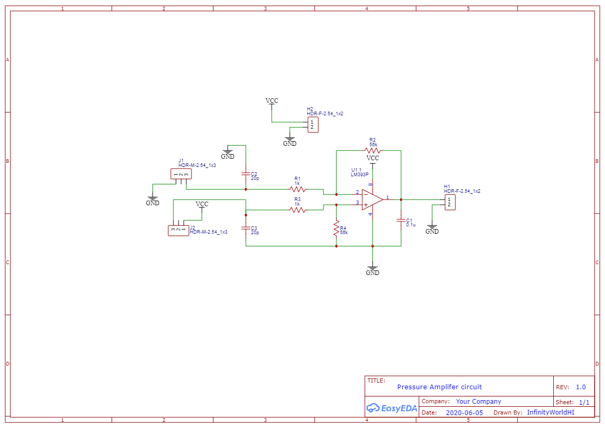

# Pressure-sensor-26PC05SMT

<h2>The needed parts:</h2>

  * LM393P OpAmp    x1
  * 56Kohm resistor x2
  * 1Kohm resistor  x2
  * 20pF capacitor  x2
  * 100nF capacitor x1
  
<h2> Here the PCB of the circuit:</h2>
  

<h2> Here the circuit schematic: </h2>
  

